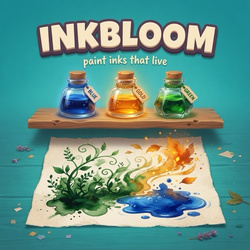
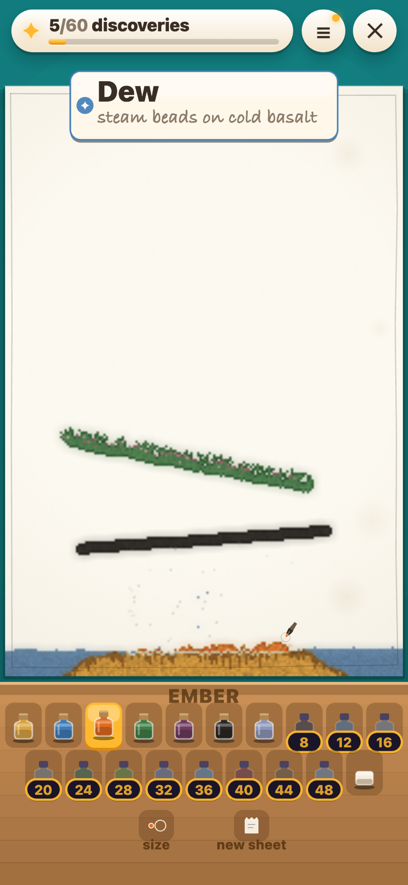

# Inkbloom

<p align="center">
  
</p>

<p align="center"><strong>paint inks that live</strong></p>

A portrait sandbox for [RUN.world](https://run.world). Eighteen inks are poured
onto a sheet of rag paper; they pile, flow, climb, burn, melt, creep, conduct,
set and bloom — and where two of them meet something happens that the page has
not told you about yet. There are sixty of those secrets. Finding them is the
whole game.

<p align="center">
  
</p>

Built on **PixiJS 8** with a WebGPU-first renderer (automatic WebGL fallback),
**React 19** for the shell, and **RUN Game SDK 5.24**.

| | |
| --- | --- |
| **Game ID** | `gCoSWVsu7MchgqeaLNrM` |
| **Private play** | https://w.run/u/gCoSWVsu7MchgqeaLNrM/private |
| **Orientation** | Portrait |

---

## Playing

Pour an ink. Watch what it does. Pour a second one into it.

- **The shelf** — nineteen slots in two rows: six inks to start, twelve more
  that arrive every four discoveries up to 48, and a kneaded eraser. Below them,
  the brush size and a torn-off sheet to start again.
- **Field Notes** — the progress chip opens the journal. Sixty lines; the found
  ones are titled, the rest are blank. Each blank line can be nudged, which
  writes a marginal note next to it — never a recipe.
- **Today's Page** — a short daily brief, drawn only from secrets you already
  know. Keeping it banks a nudge and extends a streak.
- **The page stirs** — while the sheet holds every ink of some secret you have
  not found yet, the rule border breathes a faint gold. It never says which
  secret, or where; it only says *keep going*.
- **The Folio** — tearing a painted sheet no longer destroys it: the last ten
  land in a gallery on the Record screen, and any of them can be shared as an
  image from there.
- **The Colophon** — the sixtieth secret summons a one-time ceremony.

Keyboard: `1`–`0` then `Q`–`I` select inks, `E` erases, `B`/space toggles brush
size, `M` mirrors (with the Kit), `X` tears the sheet off, arrows cycle the shelf.

## Architecture

| Path | What lives there |
| --- | --- |
| `src/game/sim/` | The simulation. Pure, headless, deterministic — no canvas, no DOM, no Pixi. This is what `npm run simulate` proves. |
| `src/game/scene/` | The Pixi scene: paper generation, cells-to-pigment, the hand-drawn shelf, layout, and input. |
| `src/systems/` | Progress, save, hints, the daily prompt, monetization, and background services. |
| `src/ui/` | The React shell: title, header, and the panels. |
| `src/sdk/` | The RUN boundary. `runSdk.ts` for lifecycle and storage; `runCommerce.ts` for anything that costs money. |
| `src/assets/art/` | Painted key-art masters (store tile + title hero). |

Two renderer rules worth knowing before you touch paint code (full detail in
[`AGENTS.md`](AGENTS.md)):

1. **The ink layer never carries a Pixi filter directly** — multiply + filter
   silhouettes every ink black; composite into a plate first.
2. **Hot-path RNG is `SimRandom`**, not `NoiseRandom` or `Math.random()`.

## Art direction

A bright craft table: saturated teal ground, warm wooden shelf of ink bottles,
cream cards with chunky bevelled edges, amber for progress and reward. The page
is a real sheet of rag paper. Full notes: [`docs/art-direction.md`](docs/art-direction.md).

## Monetization

Hybrid — two Run Bits products and two player-initiated rewarded placements. No
interstitials. Every secret, every ink, and the daily page stay free forever.

| Offer | Price / type |
| --- | --- |
| **A Pot of Ink** | 120 RB · consumable · ten nudges |
| **The Illuminator's Kit** | 400 RB · durable · extra sheets, mirror nib, unlimited nudges |
| **A Nudge from the Margin** | Rewarded · Field Notes |
| **Borrow an Ink** | Rewarded · next locked bottle for one sheet |

See [`docs/monetization.md`](docs/monetization.md).

## Commands

```sh
npm run dev            # local development on :5184
npm run dev:playground # opt-in RUN Playground (real services, real purchases)
npm run typecheck
npm run simulate       # headless proof: RNG parity, all 60 secrets reachable, determinism
npm run test           # invariants + NoiseRandom + simulate
npm run build          # embedded-libraries production build
npm run build:bundled  # standalone production build
npm run check          # format, lint, test, public audit, both builds
npm run thumbnail      # re-encode public key art from src/assets/art/
npm run visual-qa      # headless screenshots of every screen
```

Development query parameters (`?screen=`, `?debug=1`, `?qa=1`) are
development-only and can never fabricate a RUN outcome.

## Deploying

```sh
npm run build
rundot deploy          # private by default
rundot game set-public # only when you want it on explore
```

Build immediately before every deploy. Shop and LiveOps configs live under
`rundot/`.
